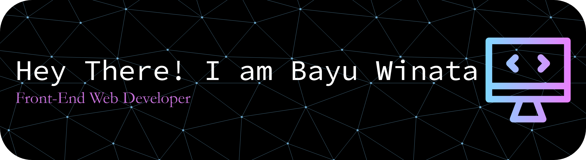

<!--
<h2 align="left">Hi There👋!  My name is Bayu Winata Front-end Web Developerr</h2> -->

###

  

###

<h2 align="left">My Skills</h2>

###

  
  
  
  
  
  
  
  
  
  
  
  
  
  
  
  
  
  
  
  
  
  
  
  
  
  
  
  
  
  
  
  
  
  
  
  
  
  
  
  
  
  
  
  
  
  
  
  
  
  
  
  
  
  
  
  
  
  
  
  
  
  
  

###

<h2 align="left">Let's Connect!!</h2>

###

  
  
  

  
  

###

 

###

  

###

###

